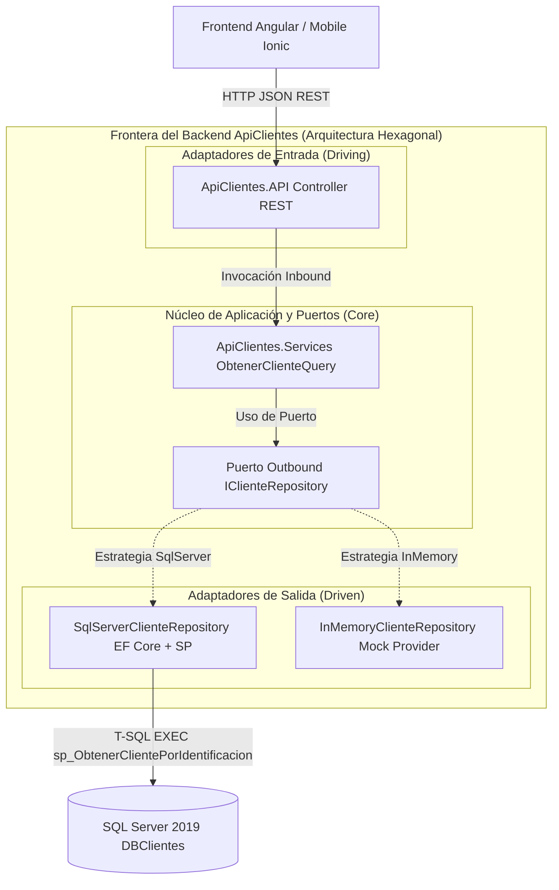

# HOJA DE RUTA Y ARQUITECTURA DE SOLUCIÓN (ROADMAP & ADRs)

**Proyecto:** Sistema de Gestión y Consulta de Clientes (Cavipetrol)  
**Autor:** Sr. Wolfan (Arquitecto de Soluciones Senior - Corbeta)  
**Asesor:** Asistente Senior de Arquitectura  
**Enfoque:** Executive Tech, Data-First & Hexagonal Clean Architecture  
**Fecha de Actualización:** 2026-08-07  

---

## 1. Estrategia Data-First y Flujo de Desarrollo

El proyecto adoptó un enfoque **Data-First (Modelo de Datos Primero)**. La arquitectura de datos formalizada en [01-database/DBClientes.dbml](file:///c:/Dev/TriposProyectosC%23/01-database/DBClientes.dbml) y [01-database/script_dbclientes.sql](file:///c:/Dev/TriposProyectosC%23/01-database/script_dbclientes.sql) constituye el contrato único de verdad sobre el cual se construyeron el prototipo visual (Look & Feel) y las especificaciones del Backend y Frontend.

```text
+-----------------------------------+      +-----------------------------------+      +-----------------------------------+
| 1. MODELO DE DATOS (BDML / SQL)   | ---> | 2. LOOK & FEEL (POC Apple UI)     | ---> | 3. BACKEND & FRONTEND (PROD)      |
| (01-database/script_dbclientes)   |      | (02-poc-look-and-feel/index.html) |      | (03-backend & 04-frontend)        |
+-----------------------------------+      +-----------------------------------+      +-----------------------------------+
```

---

## 2. Blueprint del Backend .NET (Clean Architecture & Ports/Adapters)

El backend en `03-backend-dotnet/` implementa una **Arquitectura Hexagonal (Puertos y Adaptadores) / Onion Architecture** estructurada en 5 capas desacopladas respetando los principios SOLID y la Inversión de Dependencias (DIP):

```text
ApiClientes.sln
├── ApiClientes.API/           [Adaptador de Entrada HTTP] (Controllers Delgados, Swagger, Middleware JWT)
├── ApiClientes.Services/      [Capa de Aplicación y Puertos] (Casos de Uso, Ports/Inbound y Ports/Outbound)
├── ApiClientes.Repositories/  [Adaptadores de Salida Persistencia] (Dual Provider: SqlServer y InMemory)
├── ApiClientes.DTOs/          [Contratos de Transferencia] (ClienteDto, ApiResponse<T>)
└── ApiClientes.Domain/        [Núcleo del Dominio] (Entidad Cliente pura y validaciones invariantes)
```

### 2.1. Diagrama de Componentes C4 (Nivel 3 - Arquitectura Hexagonal / Ports & Adapters)



### 2.2. Patrón Dual Provider (SqlServer vs. InMemory)

Para garantizar resiliencia en la evaluación y facilitar pruebas locales instantáneas sin dependencia forzada de base de datos, el repositorio de datos implementa el patrón **Strategy / Provider**:

* **`SqlServerClienteRepository`:** Proveedor de producción que ejecuta el Stored Procedure `sp_ObtenerClientePorIdentificacion` mediante EF Core.
* **`InMemoryClienteRepository`:** Proveedor de pruebas con dataset mockeado en memoria.
* **Conmutación:** Transparente vía `appsettings.json` (`"DataProvider": "SqlServer"` o `"DataProvider": "InMemory"`).

---

## 3. Blueprint del Frontend Angular (Standalone & Mobile-Ready Architecture)

El frontend en `04-frontend-angular/` adopta la **Arquitectura Angular Standalone (v17+)** junto con los **Componentes UI de Ionic (`@ionic/angular`)**, eliminando módulos legacy (`NgModule`) y logrando una experiencia móvil nativa inmediata con alta mantenibilidad:

```text
04-frontend-angular/
├── angular.json                                [Configuración de Build & Estilos Ionic]
├── package.json                                [Dependencias Angular 17 & Ionic Standalone]
└── src/
    ├── main.ts                                 [Bootstrap Application Standalone]
    ├── environments/
    │   └── environment.ts                      [Configuración URL Base API REST]
    └── app/
        ├── app.config.ts                       [Providers: Router, HttpClient, Ionic]
        ├── app.routes.ts                       [Definición de Rutas SPA]
        ├── models/
        │   ├── cliente.model.ts                [Interfaz ClienteDto]
        │   └── api-response.model.ts           [Interfaz ApiResponse<T>]
        ├── services/
        │   └── cliente.service.ts              [Servicio HttpClient de Clientes]
        ├── interceptors/
        │   └── auth-and-error.interceptor.ts   [Interceptor Funcional JWT & Errors]
        └── components/
            └── cliente-search/                 [Componente Standalone de Búsqueda 360°]
```

| Elemento Seleccionado | Componente / Artefacto | Valor y Justificación de Negocio |
| :--- | :--- | :--- |
| **Standalone Components** | `ClienteSearchComponent` | UI ligera de búsqueda y ficha de cliente sin sobrecosto de módulos. |
| **Ionic UI Components** | `@ionic/angular` (`ion-searchbar`, `ion-card`) | Experiencia visual móvil nativa iOS/Android inmediata en navegador web sin overhead nativo (YAGNI Capacitor). |
| **Reactive Services** | `ClienteService` | Consumo centralizado de la API REST .NET con manejo de estado reactivo. |
| **Http Interceptors** | `AuthAndErrorInterceptor` | Inyección transparente de JWT y captura global de errores sin duplicar código en UI. |
| **Environment Config** | `environment.ts` | Desacoplamiento de URLs por entorno (Dev / Staging / Prod). |
| **Directivas Nativas** | `@if`, `@for` | Control de flujo nativo de alta eficiencia en renderizado. |

---

## 4. Registro de Decisiones de Arquitectura (ADRs)

* **ADR-000 (Data-First Design):** Modelado previo del esquema DBML en `01-database/` antes de cualquier maquetación o codificación.
* **ADR-001 (Apple Minimalist Mobile UI):** Prototipo responsivo con Apple Aesthetic (`#f5f5f7`, glassmorphism, Inter font) y barra de navegación inferior móvil (0% vertical scroll).
* **ADR-002 (Clean & Hexagonal Architecture Backend):** Estructuración en 5 capas con controladores delgados (*Thin Controllers*) sin lógica de negocio.
* **ADR-003 (Dual Provider Strategy):** Abstracción de persistencia con proveedores desacoplados `SqlServer` (EF Core SP) e `InMemory` para resiliencia en pruebas.
* **ADR-004 (Zero Trust & Identity Decoupling):** Eliminación del monolito `IdentityDbContext` (YAGNI). La API actúa como *Resource Server* validando tokens JWT en el middleware HTTP (`AddJwtBearer`).
* **ADR-005 (Shared Layer Removal):** Eliminación del anti-patrón de *"cajón de desorden"* (`Shared`). Los contratos de respuesta e interfaces transversales residen en `Services` y `DTOs`.
* **ADR-006 (Mobile-First Ionic UI Integration):** Adopción inmediata de componentes web `@ionic/angular` con `provideIonicAngular()` en la SPA, garantizando interfaz móvil nativa de entrada sin sobrecosto de compilación nativa.
* **ADR-007 (Angular Standalone & Lightweight Architecture):** Adopción de componentes Standalone y descarte de NgModules/Guards complejos (YAGNI), logrando una arquitectura frontend con 0% de boilerplate innecesario y máxima velocidad de carga.

---

## 5. Matriz de Trade-offs y Mitigación de Riesgos

| Decisión | Ganancia (+ Business Value) | Costo (- Trade-off) | Estrategia de Mitigación |
| :--- | :--- | :--- | :--- |
| **Data-First con DBML** | Coherencia total entre BD, API y UI. | 30 mins iniciales de modelado. | Evita refactorizaciones y deuda técnica posterior. |
| **Dual Provider (SqlServer / InMemory)** | Resiliencia 100% en demostraciones sin BD local. | Duplicidad de implementación de interfaz. | Inyección de dependencias limpia en `Program.cs`. |
| **Thin Controllers (SRP)** | Mantenibilidad, testabilidad unitaria y orden. | Creación de clases de servicios/puertos. | Código modular alineado a buenas prácticas SOLID. |
| **Descarte de Monolito Identity** | Evita tablas innecesarias y sobreingeniería (YAGNI). | No emite tokens de prueba internamente. | Middleware JWT preparado y configurable en Swagger. |
| **SP en EF Core** | Gobierno de datos y cumplimiento estricto del PDF. | Dependencia de T-SQL en proveedor SQL. | Encapsulamiento total en `SqlServerClienteRepository`. |
| **Angular Standalone (vs NgModules)** | Carga ultrarrápida, menor bundle y mantenibilidad. | Requiere Angular v15+. | Configuración moderna con `provideHttpClient()` y `provideRouter()`. |

---

## 6. Mapeo de Evolución de Componentes (Migration Path)

| Capa / Componente | Fase 1: POC Data-First (02-poc-look-and-feel) | Fase 2: Backend .NET (03-backend-dotnet) | Fase 3: SPA / Mobile (04-frontend-angular) |
| :--- | :--- | :--- | :--- |
| **Persistencia** | Mock JS local | EF Core + SP / InMemory Provider | API REST Consumer |
| **Caso de Uso** | Event listeners en DOM | `ApiClientes.Services` (Ports & Adapters) | Reactive Services Angular |
| **Buscador** | Card minimalista HTML/CSS | Endpoint `GET /api/clientes/{id}` | Formulario Reactivo `<ion-searchbar>` |
| **Ficha Cliente** | Card 360° Apple Minimalist | `ClienteDto` DTO Contrato REST | `ClientDetailComponent` |
